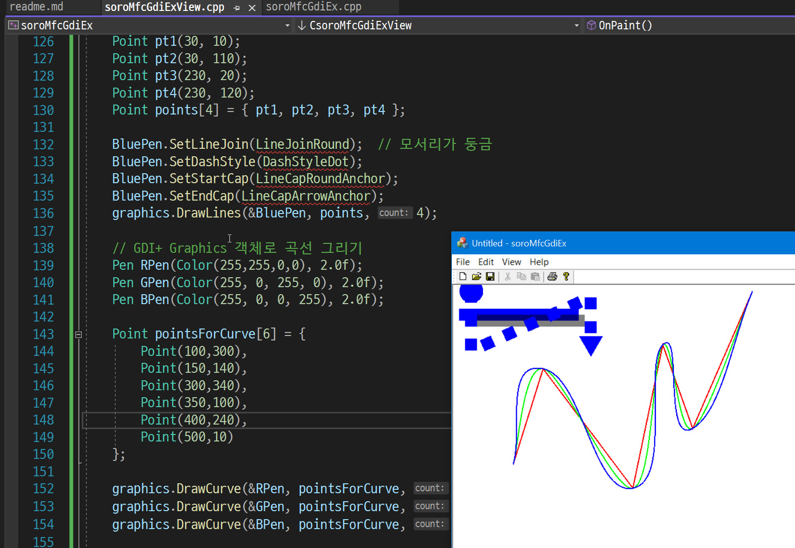

### GDI+ 사용하기 in the MFC
---
```
(framework.h)
#include <gdiplus.h>               // For Using GDI+
#pragma comment(lib, "gdiplus")    // For Using GDI+
using namespace Gdiplus;           // For Using GDI+

```

```
(xxxApp: public CWinApp)

ULONG_PTR gdiplusToken; // For Using GDI+  (전역변수)

BOOL CsoroMfcGdiExApp::InitInstance()
{
	// InitCommonControlsEx() is required on Windows XP if an application
	// manifest specifies use of ComCtl32.dll version 6 or later to enable
	// visual styles.  Otherwise, any window creation will fail.
	INITCOMMONCONTROLSEX InitCtrls;
	InitCtrls.dwSize = sizeof(InitCtrls);
	// Set this to include all the common control classes you want to use
	// in your application.
	InitCtrls.dwICC = ICC_WIN95_CLASSES;
	InitCommonControlsEx(&InitCtrls);

	CWinApp::InitInstance();

	// ※☆★ Gdiplus 사용 // For Using GDI+
	GdiplusStartupInput gidplusStartupInput;
	if (::GdiplusStartup(&gdiplusToken, &gidplusStartupInput, NULL) != Ok)
	{
		AfxMessageBox(_T("ERROR: Failed to initialize GDI+ library!"));
		return FALSE;
	}
.....

int CsoroMfcGdiExApp::ExitInstance()
{
	//TODO: handle additional resources you may have added
	AfxOleTerm(FALSE);

	::GdiplusShutdown(gdiplusToken); // For Using GDI+

	return CWinApp::ExitInstance();
}


```

---

